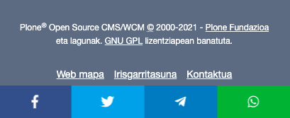
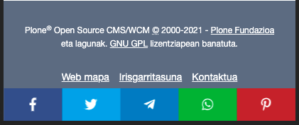
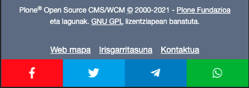

# volto-social-sharing 

Volto social sharing integration addon.

To be used with mrs-developer, see [Volto docs](https://docs.voltocms.com/customizing/add-ons/) for further usage informations.




<br>

# Table of Contents

1. [Usage](##Usage)
2. [Paths config](#paths)
3. [Customization](#Customization)
4. [New social item](#new_social_item)
5. [Edit social item](#edit_social_item)
6. [Remove social item](#remove_social_item)

<br>

## Usage
To inject the component in the project add the appextras configuration in the config.js file.

A suggested way is to use `appExtras` from settings object ([docs](https://docs.voltocms.com/recipes/appextras/)):

```jsx
import SocialSharing from '@codesyntax/volto-social-sharing/SocialSharing';

export const settings = {
  ...defaultSettings,
  appExtras: [
    ...defaultSettings.appExtras,
    {
      match: '',
      component: SocialSharing,
    },
  ],
};
```

<br>


## To determine which paths will be displayed <a name="paths"></a>

You can determine in which views the component will be displayed

```js
export const settings = {
  ...defaultSettings,
  appExtras: [
    ...defaultSettings.appExtras,
    {
      match: {
        path: ['**/ekitaldiak/**', '**/eventos/**', '/eu/albisteak/**', '/es/noticias/**'],
        exact: true,
      },
      component: SocialSharing
    },
  ],
};
```

<br>

## Customization
There are several parameters that can be customized

* **socialElements**: List of social items.
    * By default:
        * Facebook
        * Twitter
        * Whatsapp (Only on mobile)
        * Telegram (Only on mobile)
    * Options:
        * **name** (string): Social name
        * **fa_name** (array): Font awesome icon name. (It is necessary to add it in array format to determine the type of icon. Example: ["fab", "facebook-f"])
          * [Docs](https://fontawesome.com/how-to-use/on-the-web/using-with/react#features)
          * [Icon Gallery](https://fontawesome.com/icons?d=gallery)
        * **color** (string): CSS color value.
        * **sharing_url** (string): Link of the social network to share. ([Examples](https://github.com/bradvin/social-share-urls/blob/0c6d81fc950144e18ada062e0aba90d738b70d90/code/javascript/javascript/social-share-media.js#L151))
        * **only_mobile** (bool) *optional: Set to true if it will only be displayed in the mobile view.
* **bannerPosition**: Position of social items banner. 
    * By default: 
        * In the **desktop** view centered on the right.
        * In the **mobile** view centered on the bottom.
    * Options:
        * defaultPositions["desktop"] = {[React DOM Style](https://reactjs.org/docs/dom-elements.html#style)}
        * defaultPositions["mobile"] = {[React DOM Style](https://reactjs.org/docs/dom-elements.html#style)}
* **logoSize**: Font Awesome logo size. ([Doc](https://fontawesome.com/how-to-use/on-the-web/using-with/react#features))
    * By default: "lg".
    * [Options](https://fontawesome.com/how-to-use/on-the-web/styling/sizing-icons#scale): "lg" | "xs" | "sm" | "2x" | "3x" | "4x" | "5x" | "6x" | "7x" | "8x" | "9x" | "10x"       
* **buttonSize**: Button with and height.
    * By default: "30px"


<br>

## Add new social item <a name="new_social_item"></a>

```js
// import default social list
import {DEFAULT_SOCIAL} from '@codesyntax/volto-social-sharing/defaultSettings';

// Push new item
DEFAULT_SOCIAL.push({
  name: "Pinterest",
  fa_name: ["fab", "pinterest-p"],
  color: "#c8232c",
  sharing_url: "http://pinterest.com/pin/create/link/?url=",
  id: "pt"
});

export const settings = {
  ...defaultSettings,
  appExtras: [
    ...defaultSettings.appExtras,
    {
      match: {
        path: ['**/ekitaldiak/**', '**/eventos/**', '/eu/albisteak/**', '/es/noticias/**'],
        exact: true,
      },
      component: SocialSharing,
      props:{
           socialElements: DEFAULT_SOCIAL
      }
    },
  ],
};
```

#### Example





<br>

## Change existing social item value <a name="edit_social_item"></a>

```js
// import default social list
import {DEFAULT_SOCIAL} from '@codesyntax/volto-social-sharing/defaultSettings';

// Find social item by id
let facebook = DEFAULT_SOCIAL.find(social => social.id == "fb");
if (facebook) {
  facebook.color = "red";
}
export const settings = {
  ...defaultSettings,
  appExtras: [
    ...defaultSettings.appExtras,
    {
      match: {
        path: ['**/ekitaldiak/**', '**/eventos/**', '/eu/albisteak/**', '/es/noticias/**'],
        exact: true,
      },
      component: SocialSharing,
      props:{
        socialElements: DEFAULT_SOCIAL
      }
    },
  ],
};
```

#### Example





<br>

## Remove existing social item <a name="remove_social_item"></a>

```js
// import default social list
import {DEFAULT_SOCIAL} from '@codesyntax/volto-social-sharing/defaultSettings';

// Remove social item by id
const index = DEFAULT_SOCIAL.findIndex(social => social.id === "fb");
if (index !== undefined) DEFAULT_SOCIAL.splice(index, 1);

export const settings = {
  ...defaultSettings,
  appExtras: [
    ...defaultSettings.appExtras,
    {
      match: {
        path: ['**/ekitaldiak/**', '**/eventos/**', '/eu/albisteak/**', '/es/noticias/**'],
        exact: true,
      },
      component: SocialSharing,
      props:{
        socialElements: DEFAULT_SOCIAL
      }
    },
  ],
};
```


<br><br><br>
*Icon author:* Throwaway icons - https://thenounproject.com/search/?q=share&amp;i=1343423, CC BY 3.0, https://commons.wikimedia.org/w/index.php?curid=89416553